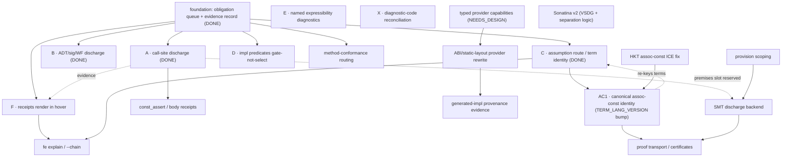

# FCO Consolidation Map

This document is a repo-grounded map of features in the Fe compiler that
already share — or could be migrated onto — one common obligation/evidence
pathway, plus **one** recommended first implementation task. It is a planning
artifact, not a rewrite. Every claim below cites a file/function/line in the
`first-class-obligations` branch; where the line drifts from the prior
investigation it is noted inline.

## The principle

The recurring shape across many Fe features is:

> **demand → obligation/provision lookup-or-discharge → evidence → consumer**

Something *demands* a fact (a call needs a trait impl; a `where` predicate must
hold; a derive needs a capability; an ABI path needs a static layout). The
demand becomes an **obligation/provision** that is either *looked up* (trait
impl selection) or *discharged* (CTFE of a const predicate, proof, scope/
authority check). Success produces **evidence** — a typed record of *how* the
goal was committed — which a **consumer** (lowering, LSP hover, optimizer,
diagnostics) reads.

The goal is **NOT** "everything becomes a const predicate" and **NOT** "one
solver." It is: *more features become producers/consumers of the same
obligation/evidence pathway, with specialized discharge backends*
(trait = lookup via `ProofForest`; const predicate = CTFE; capability =
scope/authority), so that trait-only, ad-hoc, and string-keyed parallel logic
can be retired.

M5 already built the spine for one backend:

- The shared queue: a single `Vec<DeferredTask>` holding both
  `DeferredTask::Obligation(TraitObligation)` and
  `DeferredTask::ConstPredicate(ConstPredicateObligation)`
  (`ty_check/env.rs:1601-1606`), drained by `resolve_deferred`
  (`ty_check/mod.rs:1473`).
- The const-predicate backend: `process_const_predicate_obligation`
  (`ty_check/mod.rs:1387`) evaluates a closed predicate body by CTFE under the
  call's type substitution.
- The evidence: `DischargedConstPredicate { origin, predicate, generic_args,
  route: DischargeRoute::Ctfe, premises: Vec<CheckPremise> }`
  (`ty_check/mod.rs:3006-3018`), recorded by `record_discharged_const_predicate`
  (`ty_check/mod.rs:1458`), with `DischargeRoute` (`:2955`, only `Ctfe` today)
  and the reserved `CheckPremise` slot (`:2971`).
- The (single) producer wiring: `Callable::enqueue_constraints`
  (`ty_check/callable.rs:759`), const-predicate arm at `:797-813`, gated on
  `CallableDef::Func` only.
- A consumer: per-call accessors `discharged_const_predicates_for_call`
  (`ty_check/mod.rs:3427`) and `discharged_obligations_for_call` (`:3405`).

The verified gaps are that **only call sites** of **functions** produce const
obligations, and **only CTFE under fully-concrete args** discharges them —
every other position (ADT construction, signatures/WF, impl-method
conformance), every other discharge route (assumption/verbatim), and every
other parallel provision path (effects, derive providers, hardcoded ABI/event/
error lowering) is outside the pathway.

---

## Immediate consolidation candidates

| # | Candidate | Current locus | Smell | Target FCO shape | Difficulty | Risk | Label |
|---|-----------|---------------|-------|------------------|-----------|------|-------|
| 1 | Const predicates beyond call sites (ADT construction + signature/WF) | `callable.rs:797` (Func-only), `expr.rs:3634` `check_record_init` (no enqueue), `trait_resolution/mod.rs:278` `check_ty_wf` / `:338` `check_trait_inst_wf` (trait-only) | A `where MIN<=MAX` on a struct/enum parses and is accepted at decl, then is **never enforced** at construction or in signature positions | Enqueue ADT `const_predicates` at construction; check them in WF/signature positions; reuse `DeferredTask`/`DischargedConstPredicate` | M | Med | **LANDED** (Gate 1/3; ADT/sig const-preds enforced via WF `ty_const_predicate_violation` mod.rs:4864 ← check_ty_wf) — keep regression guard |
| 2 | Assumption-route discharge (generic caller restates a bound) | `mod.rs:1423-1425` stub returns `Discharged` silently; `term.rs:425` `lower_hir_to_term` + `:807` `normalize_term` unused by discharge | Symbolic args silently discharge with **no evidence and no exact-match diagnostic**; a mismatched forwarded bound is accepted | New `DischargeRoute::Assumption`; lower predicate to a normalized term; exact-match against caller's harvested const-predicate assumption set | M | Med | **LANDED** (Gate 4-7; `DischargeRoute::Assumption` mod.rs:1542, normalized-term exact match) — keep regression guard |
| 3 | Impl-method const-predicate conformance | `method_cmp.rs:62` `compare_impl_method`, `compare_const_predicates` (`:1050-1086`) | ~~An impl method may weaken/strengthen the trait method's const predicates with **no error**~~ | Compare const-predicate sets by normalized-term identity (reuses #2 machinery) | S–M | Low | **LANDED** (M0, `468bb69b7`; emits `6-0016`) |
| 4 | Const-predicate WF in signature positions | `trait_resolution/mod.rs:278/338`; invoked via `ty_def.rs:630` `emit_wf_diag` | `check_ty_wf` runs trait constraints but **ignores** const predicates on the type's where clause | Fold const-predicate checking into WF (the signature half of #1) | M | Med | **LANDED** (with #1) — keep regression guard |
| 5 | Hardcoded ABI/event/error lowering vs derive providers | `core/lower/event.rs`, `error.rs` (`lower_error_abi_size_impl`/`encode_impl` ~365-439), `msg.rs` (HEAD_SIZE/IS_DYNAMIC HIR), `crates/fe/src/abi.rs:~1452` | Parallel Rust provision path: bypasses `DeferredTask`, produces **no evidence**, not extensible from Fe; HEAD_SIZE/IS_DYNAMIC are exactly what const predicates could verify | Migrate to Fe derive providers; verify layout consts via const-predicate obligations | L | High | **M6_OR_POST** |
| 6 | Typed provider `uses` capabilities | `core/lower/provider.rs` (`REFLECT_KEY`/`IMPL_BUILDER_KEY`/`DERIVE_*` string keys, `:30-35`), `provider_executor.rs` (string-keyed dispatch `:1485-1486`, budgets) | Capabilities are **string-keyed**, not typed; provider execution yields an impl but **no `DischargedObligation`** | Type `uses` signatures as compile-time-only capability obligations with evidence | L | High | **NEEDS_DESIGN** |
| 7 | LSP hover renders const-predicate evidence | `language-server/.../hover.rs:243` `discharged_obligations_footer` reads `discharged_obligations_for_call` (`:250`) but never `discharged_const_predicates` | Hover shows trait discharges but **not** const-predicate discharges, though `discharged_const_predicates_for_call` (`mod.rs:3427`) already exists | One-function extension to render route/premises | S | Low | **READY_NOW** |
| 8 | Effect witnesses as obligations | `effects.rs` (`EffectKeyKind`/`ResolvedEffectKey`), `ty_check/effect_env.rs` `EffectEnv`, `constraint.rs:34` `collect_func_effect_provider_constraints` converts `uses` → trait predicates | Parallel resolution path; effect satisfaction produces no `DeferredTask` evidence | Effect witnesses as `DeferredTask` obligations with evidence | L | High | **DO_NOT_REWRITE_YET** |
| 9 | MIR runtime-class merge | `mir/.../runtime/lower/infer.rs` `merge_runtime_class` (~1132-1211) | Hardcoded, order-sensitive class merge | Speculative; out of the obligation path entirely | L | High | **DO_NOT_REWRITE_YET** |

### Per-item notes

#### 1. Const predicates beyond call sites — **LANDED** (Gate 1/3; keep regression guard)
- **Current mechanism.** Const predicates are enqueued **only** in
  `Callable::enqueue_constraints` (`callable.rs:759`), inside a
  `if let CallableDef::Func(func)` guard at `:797`. ADT construction
  (`check_record_init`, `expr.rs:3634`) enqueues **no** where-clause obligations
  of any kind — verified: the trait-obligation `register_trait_obligation`
  calls in `expr.rs` (`:3192,3464,3559,4298,4372`) are for operator/method
  paths, not record construction. Signature/WF runs through `check_ty_wf`
  (`trait_resolution/mod.rs:278`) and `check_trait_inst_wf` (`:338`), both of
  which iterate **trait** constraints only.
- **Smell / duplication.** `WhereClauseOwner` already enumerates `Struct`,
  `Enum`, `Impl`, `Trait`, `ImplTrait` (`hir_def/item.rs:378-385`) and
  `const_predicates` is a real field on every where clause
  (`hir_def/params.rs:115`). The decl-site checker `check_where_const_predicates`
  (`mod.rs:271`) already runs over **all** owners (`analysis/ty/mod.rs:402-403`)
  and *conservatively skips* parameterized predicates (`mod.rs:292`,
  `params_in_scope`), explicitly deferring them "to the use site." But that use
  site only exists for function calls. The fixture
  `where_const_predicate_bare.fe` already declares
  `struct Wrap<T> where T: Sized, T::SIZE <= 32` and `enum Opt<T> where ...` —
  accepted at declaration, enforced **nowhere**.
- **Target FCO shape.** Add a `ConstPredicateObligationOrigin::AdtConstruction`
  (and/or `Signature`) variant (`env.rs:1636`); enqueue ADT `const_predicates`
  at `check_record_init`/`check_record_init` enum arm (`expr.rs:3634,3702`); add
  a const-predicate pass inside `check_ty_wf` mirroring the trait loop at
  `trait_resolution/mod.rs:306-315`. All discharge reuses
  `process_const_predicate_obligation` and `DischargedConstPredicate`.
- **First correctness fixture.**
  ```fe
  struct Bounded<const MIN: u256, const MAX: u256> where MIN <= MAX { lo: u256 }
  fn ok()  { let _ = Bounded::<1, 4> { lo: 1 } }   // discharges
  fn bad() { let _ = Bounded::<4, 1> { lo: 1 } }   // 8-0085 at construction
  fn sig(_ x: Bounded<4, 1>) {}                     // 8-0085 at signature, never called
  ```
- **Difficulty** M. **Risk** Med — touches WF (a hot, salsa-tracked path) and
  record-init checking; must avoid double-reporting against the decl-site check.

#### 2. Assumption-route discharge — **LANDED** (Gate 4-7; keep regression guard)
- **Current mechanism.** When a generic caller forwards its own type parameter
  (`fn mid<B: Platform>() where B::WORD_BITS == 256 { word_op::<B>() }`), the
  args still mention a param, so `process_const_predicate_obligation` hits the
  symbolic branch at `mod.rs:1423-1425` and returns `Discharged` **silently,
  with no evidence** (comment at `:1416-1422` names this the "verbatim-match
  route, not part of this slice"). The test
  `symbolic_assoc_const_lowers_and_forwards_without_error`
  (`tests/m5_const_predicate_discharge.rs:128`) pins exactly this
  no-false-discharge behavior, and a paired **quarantined** test
  `assumption_route_mismatch_is_rejected` (`:466-478`, `#[ignore]`) already
  encodes the target: `bad_forward<B> where B::WORD_BITS == 128` calling a
  callee requiring `== 256` must be rejected `8-0085`.
- **Smell / duplication.** A normalized-term module exists
  (`term.rs`, `TERM_LANG_VERSION = 1` at `:72`) with `lower_hir_to_term`
  (`:425`) and `normalize_term` (`:807`) — but it is **not connected** to
  discharge; `process_const_predicate_obligation` works off the raw `Body` +
  `Vec<TyId>`. The caller's own const predicates are also never harvested:
  `collect_decl_constraints_with_assumptions` (`constraint.rs:326`) gathers
  **`TypeBound::Trait` only** (`:345,376`); const predicates are dropped on the
  floor.
- **Target FCO shape.** Add `DischargeRoute::Assumption`. Harvest the caller's
  where-clause const predicates into a normalized-term assumption set (extend
  `constraint.rs:326` or add a sibling); in the symbolic branch, lower the
  obligation predicate to a normalized term and require an **exact** member of
  the assumption set (no implication, no fuzzy match — mirrors trait
  `is_query_satisfiable` set membership). Hit → record evidence with
  `route: Assumption`; miss → `8-0085`.
- **First correctness fixtures.** (positive) the `mid` forward above now records
  **one** `DischargedConstPredicate` with `route == Assumption`; (negative)
  un-`#[ignore]` `assumption_route_mismatch_is_rejected`.
- **Difficulty** M. **Risk** Med — term lowering must be total enough for real
  predicates or fall back conservatively; must not regress the
  no-false-discharge invariant.

#### 3. Impl-method const-predicate conformance — **LANDED (M0, `468bb69b7`)**
- ~~`compare_constraints` compares trait constraints only; an impl method can
  silently weaken/strengthen const predicates.~~ **Done.** `compare_impl_method`
  (`method_cmp.rs:62`) now calls `compare_const_predicates`
  (`method_cmp.rs:1050-1086`), which compares the impl-method vs trait-method
  const-predicate sets by **normalized-term identity** (reusing #2's term
  machinery, plus `func_predicate_assumptions` to supply the implicit
  `Self: Trait` so a trait method's `Self::SIZE`-style predicate lowers) and
  emits **`6-0016`** `MethodConstPredicateMismatch` (`diagnostics.rs:1074`,
  TraitSatisfaction pass) on mismatch. Tracked as task M0 / graph node MC00.

#### 4. Const-predicate WF in signatures — **LANDED** (folded into #1; keep regression guard)
- This is the signature half of #1: `check_ty_wf` (`trait_resolution/mod.rs:278`,
  invoked at `ty_def.rs:630`) must run const predicates. Listed separately
  because it is the part of #1 with the highest blast radius (salsa-tracked WF),
  but it ships together with #1.

#### 5. Hardcoded ABI/event/error lowering — **M6_OR_POST**
- `core/lower/event.rs`, `error.rs` (`lower_error_abi_size_impl`/`encode_impl`
  ~365-439), `msg.rs` (generates `HEAD_SIZE` u256-sum and `IS_DYNAMIC` bool-OR
  HIR), and `crates/fe/src/abi.rs:~1452` (ABI assoc consts) form a parallel
  provision path that bypasses `DeferredTask`, records no evidence, and cannot
  be extended from Fe. The `HEAD_SIZE`/`IS_DYNAMIC` consts are precisely what a
  const-predicate obligation could **verify** (cf. the
  `where_const_predicate_abi_static_layout.fe` fixture, which already gates an
  ABI path on `T::IS_DYNAMIC == false`). Prime migration target — but it depends
  on candidate 6 (typed providers) and on #5's own large surface; not first.

#### 6. Typed provider `uses` capabilities — **NEEDS_DESIGN**
- `provider.rs` keys capabilities by head identifier string (`REFLECT_KEY`,
  `IMPL_BUILDER_KEY`, `:30-35`); `provider_executor.rs` dispatches on those
  strings (`:1485-1486`) under a step/command budget; `provider_synthesis.rs`
  replays builder commands into impl HIR (`synthesize_provider_impl`). Execution
  produces an impl but **no `DischargedObligation`** evidence. Typing `uses`
  signatures as compile-time-only capability obligations is the bridge to #5,
  but the capability grade/key system is explicitly minimal today
  (`provider.rs:176-187`) and needs a design pass before code.

#### 7. LSP hover renders const-predicate evidence — **READY_NOW**
- `discharged_obligations_footer` (`hover.rs:243`) reads
  `discharged_obligations_for_call` (`:250`) but never the **already-existing**
  `discharged_const_predicates_for_call` (`mod.rs:3427`). A second filter_map
  block rendering `route`/`premises` is a self-contained, low-risk consumer
  extension. (This is the *cheapest* item but not the highest-leverage; see
  "First recommended rewrite.")

#### 8–9. Effects / MIR — see "Not-yet candidates."

---

## Not-yet candidates (do NOT rewrite now)

- **Effect-env unification (8).** `effect_env.rs` `EffectEnv` and
  `collect_func_effect_provider_constraints` (`constraint.rs:34`) already
  *partially* converge by lowering `uses` to trait predicates. Folding effect
  witnesses into `DeferredTask` evidence is plausible long-term, but the effect
  resolution model (keys, providers, scoping) is still moving and would couple
  two large subsystems mid-flight. **DO_NOT_REWRITE_YET.**
- **Full provision-scoping.** Capability/authority scoping (who may provide
  what, where) is the back half of candidates 6/8 and has no design yet.
  **NEEDS_DESIGN**, not now.
- **MIR runtime-class merge (9).** `merge_runtime_class`
  (`mir/.../runtime/lower/infer.rs` ~1132-1211) is hardcoded and order-sensitive
  but lives entirely below type checking, outside the obligation/evidence path.
  Speculative/post-M5. **DO_NOT_REWRITE_YET.**
- **Full provider body typing.** Typing the full bodies of provider functions
  (vs. just their `uses` signatures) is a much larger effort than candidate 6
  and is not required to retire string-keyed *dispatch*. **NEEDS_DESIGN.**
- **Full EIP-712.** `ingots/std/src/eip712.fe` `StableEip712` is a real Fe
  provider already; a full EIP-712 implementation is product scope, not
  consolidation. **DO_NOT_REWRITE_YET.**

---

## Arithmetic-unchecked caveat

A const predicate proves a fact about **compile-time constants** under a known
type substitution: `B::WORD_BITS == 256`, `MIN <= MAX`, `T::IS_DYNAMIC ==
false`. It is evaluated by CTFE on a **closed** term
(`process_const_predicate_obligation`, `mod.rs:1432`).

It does **NOT** prove anything about **runtime** values. In particular, a
discharged const predicate does **not** prove that a runtime expression like
`ptr + const_offset` cannot overflow: the pointer is a runtime value; only the
offset is a compile-time constant. Compile-time **layout facts** (sizes,
alignments, "is this type statically sized") are categorically different from
runtime/resource facts (this address is in bounds, this addition does not wrap,
this resource is still live).

Therefore: **do not** propose replacing `#[arithmetic(unchecked)]` with a const
predicate. That attribute asserts a *runtime* non-overflow property that
const-predicate CTFE cannot establish. The honest future story is the
`premises` slot (`CheckPremise`, `mod.rs:2971`, empty for every M5 route by
design, `:3015-3017`): a *runtime* check-elision discharge would record, via
`premises`, exactly which prior facts (layout fact + a separately-proven range
fact, e.g. from a future resource/proof backend) it depended on. Evidence that
cannot record those dependency edges cannot be retrofitted into a sound
check-elision argument — which is the whole reason the slot exists now even
though nothing populates it. Keeping layout facts and runtime facts on the same
pathway but on **different routes with explicit premises** is what preserves
that future, *without* pretending compile-time facts discharge runtime ones.

---

## First recommended rewrite

### Choice: **Candidate 1 — extend const-predicate discharge to ADT construction + signature/WF positions** (CORE_M5_NEXT — now LANDED, Gate 1/3)

#### Why this one (vs. B/2 and the others)

I evaluated all three steered options against five criteria — clear before/
after, reduces special-case code, reuses M5 evidence/obligation machinery,
strong demo fixture, and no dependency on Sonatina v2 / full provider typing /
full provision scoping.

- **(B) Typed provider capabilities (candidate 6)** scores worst on
  *reuse* and *no-dependency*: the capability grade/key system is explicitly
  minimal (`provider.rs:176-187`) and labeled **NEEDS_DESIGN**; it would need a
  design pass and produces no `DischargedConstPredicate`, so it does not reuse
  the M5 evidence type. Strong eventual payoff (it unlocks candidate 5), but not
  a *first* step.
- **(C) Assumption route (candidate 2)** is genuinely attractive — it has a
  pre-written quarantined fixture (`assumption_route_mismatch_is_rejected`) and
  reuses `term.rs`. But it is the *narrower* win: it generalizes the
  **discharge backend** for one already-wired position (function call sites). It
  does not broaden *where obligations are produced*, and it carries the risk
  that `lower_hir_to_term` must be total enough for arbitrary predicates.
- **(A) ADT construction + signature/WF (candidate 1)** best matches the
  consolidation thesis: it makes **more positions producers** of the *same*
  obligation, reusing `DeferredTask`, `process_const_predicate_obligation`, and
  `DischargedConstPredicate` essentially unchanged. The structural plumbing
  already exists (`WhereClauseOwner` covers Struct/Enum, `const_predicates` is a
  real field, the decl-site checker already deliberately defers parameterized
  predicates "to the use site" at `mod.rs:292`). It closes a **visible
  soundness hole** demonstrated by an in-tree fixture (`Wrap`/`Opt` where
  clauses accepted but unenforced). And it has the strongest demo:
  `Bounded<4,1>` rejected at construction **and** at a signature it never calls.

The prior reviewer leaned A-then-B; I concur on **A first**, but I rank **C
(assumption route) as the immediate follow-up** rather than B, because C also
reuses the M5 evidence machinery and has its fixture already written — together
A + C make const predicates a first-class obligation at *every position* and via
*both routes*, which is the cleanest consolidation milestone before touching the
provider/ABI surface.

#### Before / after

- **Before.** A const predicate is enforced **iff** it sits on a `fn` *and* that
  `fn` is *called* with fully concrete args. `struct Bounded<...> where MIN<=MAX`
  is accepted, then `Bounded::<4,1>{...}` and `fn f(_ x: Bounded<4,1>)` compile
  silently.
- **After.** A const predicate is enforced at ADT construction and in signature/
  WF positions too, via the same obligation queue and the same
  `DischargedConstPredicate` evidence. `Bounded::<4,1>` and the signature usage
  fail with `8-0085`; `Bounded::<1,4>` discharges and records evidence.

#### Exact files to touch

1. `crates/hir/src/analysis/ty/ty_check/env.rs` — add
   `ConstPredicateObligationOrigin::AdtConstruction { call_expr, adt, predicate_idx }`
   (and a `Signature`/`Wf` origin if WF needs to key evidence) near `:1636`;
   extend `DischargedConstPredicate::call_expr` match (`mod.rs:3022`)
   accordingly (currently exhaustive on one variant).
2. `crates/hir/src/analysis/ty/ty_check/expr.rs` — in `check_record_init`
   (`:3634`, both the `PathRes::Ty` struct arm `:3676` and the
   `PathRes::EnumVariant` arm `:3702`), after resolving the concrete `ty`,
   harvest the ADT's `const_predicates` and `register_const_predicate_obligation`
   with the resolved generic args (mirror `callable.rs:801-813`).
3. `crates/hir/src/analysis/ty/trait_resolution/mod.rs` — in `check_ty_wf`
   (`:278`), after the trait-constraint loop (`:306-315`), add a const-predicate
   loop that evaluates each closed predicate by CTFE; on `false`/fault return an
   `IllFormed`-equivalent carrying the predicate span. (May need a sibling
   `WellFormedness` arm or a const-predicate diagnostic at the `ty_def.rs:630`
   call site to surface `8-0085`.)
4. `crates/hir/src/analysis/ty/ty_check/mod.rs` — no logic change to
   `process_const_predicate_obligation`; only the origin match in `call_expr`
   (`:3022`) and `record_discharged_const_predicate` (`:1458`) gain the new
   origin variant(s).

#### Discharge-route / evidence changes

- **No new `DischargeRoute`.** All new positions still discharge by CTFE under
  concrete args, so `route: DischargeRoute::Ctfe` is unchanged.
- **New origins only.** `ConstPredicateObligationOrigin` grows variant(s) so the
  evidence can say *where the demand came from* (construction vs. signature),
  which is what hover/diagnostics need to phrase the message. `premises` stays
  empty (still premise-free CTFE).

#### Concrete fixtures (pos + neg)

1. **Positive — construction discharges.**
   ```fe
   struct Bounded<const MIN: u256, const MAX: u256> where MIN <= MAX { lo: u256 }
   fn ok() { let _ = Bounded::<1, 4> { lo: 1 } }
   ```
   No diag; `discharged_const_predicates()` records one `Ctfe` entry keyed to
   the construction expr.
2. **Negative — construction rejected.**
   ```fe
   fn bad() { let _ = Bounded::<4, 1> { lo: 1 } }   // 8-0085 at the construction site
   ```
3. **Negative — signature rejected, never called.**
   ```fe
   fn sig(_ x: Bounded<4, 1>) {}                     // 8-0085 at the parameter type, even though sig() is never called
   ```
   (This is the headline demo: the soundness hole is closed at the *signature*,
   independent of any call.)

Plus a regression assertion that the **decl-site** check (`mod.rs:271`) does not
double-report: `struct Bounded<...> where MIN<=MAX` with parameters in scope is
still skipped at declaration (`mod.rs:292`) and reported only at use.

#### Risks

- **Double-reporting.** The decl-site checker and the new use-site checks must
  not both fire. Mitigation: the decl-site checker already early-returns on
  `params_in_scope` (`mod.rs:292`); concrete instantiations only exist at the
  use site, so the partition is clean — but add the no-double-report regression
  fixture above.
- **WF is hot and salsa-tracked.** Adding CTFE into `check_ty_wf` (`:278`) runs
  per type occurrence. Mitigation: only evaluate predicates whose args are fully
  concrete (`!has_var && !has_param`), exactly the gate already in
  `process_const_predicate_obligation` (`mod.rs:1408,1423`); symbolic signature
  positions defer to candidate 2 (assumption route), not to a false error.
- **Origin enum exhaustiveness.** `DischargedConstPredicate::call_expr`
  (`:3022`) and the two `resolve_deferred` arms (`mod.rs:1600,1773`) match
  without wildcards by design; new origins must be threaded through all match
  arms (this is a *feature* — the compiler will point at every site).

#### Ordered commit plan

1. **Origins + evidence plumbing.** Add the new
   `ConstPredicateObligationOrigin` variant(s) in `env.rs`; update the exhaustive
   matches (`mod.rs:3022`, the `resolve_deferred` arms). No behavior change yet;
   `cargo check` green.
2. **ADT-construction enqueue.** Wire `check_record_init` (struct + enum arms,
   `expr.rs:3676/3702`) to enqueue the ADT's const predicates. Land fixtures 1
   and 2 (positive construction + negative construction).
3. **Signature/WF enforcement.** Add the const-predicate loop to `check_ty_wf`
   (`trait_resolution/mod.rs:306`) and surface the diagnostic at
   `ty_def.rs:630`. Land fixture 3 (signature, never called) + the
   no-double-report regression.
4. **Consumer + docs.** (Optional, can fold candidate 7 here) extend the hover
   footer (`hover.rs:243`) to render the new construction/signature discharges,
   and update `M5_DEMO_SPINE.md` to note the broadened positions.

#### Top risk (one line)

Folding CTFE into the salsa-tracked WF path (`check_ty_wf`) without regressing
compile times or double-reporting against the existing decl-site checker — gated
by the same concrete-args predicate the M5 call-site path already uses.

---

# Milestone ladder (M5 → post-M7)

Labels, refined:

- **M5** finishes the *obligation surface*: const predicates are first-class
  everywhere a type/impl is required to hold, with exact matching and no
  specialization.
- **M6** makes *symbolic* obligation discharge principled and explainable.
- **M7** turns providers / high-level generation into FCO consumers/producers.
- **Post-M7** is SMT + Sonatina v2 + proof/resource evidence.

## M5 done = all eight hold

1. Call-site discharge works. — **landed** (`d3df3cca1`)
2. ADT / signature / WF discharge works (construction, parameter types, return
   types, struct/enum fields, local bindings, never-called signatures), via the
   shared `check_ty_wf` — **landed** (`70b0bbfdb`). *Open:* WF-position evidence
   recording; bodyless-declaration signatures.
3. Generic assumption-route exact match (matching predicate discharges by
   `Assumption`; wrong predicate fails; no boolean splitting / direction
   flipping / implication). — **required** (the ignored
   `assumption_route_mismatch_is_rejected` encodes the target).
4. Impl predicates gate, not select (selected-impl residuals discharged after
   selection; two impls differing only by a const predicate overlap; no SFINAE).
   — **required**.
5. Predicate overlap is conservative. — **required** (folds into 4).
6. CTFE faults are hard errors. — **landed** (pair 12, `3-0025`).
7. Unsupported forms fail by name. — **partial** (chained projection / unconstrained
   subject emit `2-0002`; a dedicated "not yet expressible" code is pending — see
   the diagnostic-contract note).
8. Receipts render somewhere visible (hover / `fe explain` reads
   `discharged_const_predicates`: goal, route, origin, premises). — **required**.

### Diagnostic contract (reconcile before declaring M5 done)

Live codes: `8-0085` predicate-formed-and-evaluated-false; `3-0025` hard CTFE
fault; `2-0002` true name-not-found / formation. Recommended: keep those, and
add/use `8-0086` only for "recognized but not yet expressible" forms
(e.g. chained projections). Update the exit-criteria doc's `8-0082/83/84` refs
to match, or implement the specific codes.

## M6 — symbolic obligations become principled

1. **Assumption-route exact matching** (term identity via `term.rs`;
   `lower_hir_to_term` + `normalize_term`; un-ignore the quarantined test).
   Closes gates 3/5 above.
2. **AC1 canonical assoc-const projection identity**: subject `TyId` +
   canonical trait instantiation/args + assoc-const def-id, replacing
   `AssocConst { inst: TraitInstId, name: IdentId }`. Likely bumps
   `TERM_LANG_VERSION` (treat as an internal cache/evidence fuse).
3. Any obligation surface that slipped from M5 (e.g. bodyless signatures).
4. **`const_assert` / body-assertion receipts** (`VcSite::ConstAssert`).
5. **Method-conformance queue routing + evidence origin** (the bidirectional
   check itself landed as M0/`6-0016`; `compare_const_predicates` uses **exact
   normalized-term matching, no implication solver** — the remaining work is
   routing conformance through the obligation queue with a proper evidence
   origin, not the comparison itself).
6. First useful **`fe explain` / hover** (and `--chain`).
7. HKT assoc-const ICE fix (`body.rs:730`) if still open.

## M7 — providers become typed FCO participants

1. **Typed provider capabilities**: `Reflect<T>`, `ImplBuilder<Goal>`,
   `Evidence<Goal>`, `Quote` as compile-time-only capability types, retiring the
   string-keyed (`REFLECT_KEY` / `IMPL_BUILDER_KEY`) and `is_derive_provider_fn`
   exemptions. **NEEDS_DESIGN first.**
2. **One high-level rewrite in Fe** — ABI/static-layout first (small,
   contract-relevant, uses assoc-const facts + where predicates, produces
   receipts `fe explain` can render). Event/error follow; EIP-712 last.
3. Generated-impl provenance evidence (derive site → provider → generated impl →
   layout predicates).

Do **not** start with full EIP-712, full Sonatina v2, full SMT, effect-witness
unification, or a MIR runtime-class rewrite.

## Post-M7 — architecture

1. **Provision scoping**: collapse trait env + effect env + capability env +
   generated-impl overlays + const-predicate assumptions into one scope-indexed
   provision/obligation environment (`demand → obligation`,
   `resolution → provision lookup or discharge`, `result → evidence`).
2. **SMT discharge backend**: the first real producer of non-empty `premises`
   (checked-op-as-fact).
3. **Sonatina v2 (VSDG + separation logic)**: explicit resource/state
   dependencies; cross-resource joins proven / materialized / rejected — the
   eventual successor to `merge_runtime_class` (keep it contained until a
   concrete repro forces a local fix).
4. Proof transport / certificates / law systems.

## Invariant to protect across all phases

The evidence key + `route` + origin + `premises` slot must stay non-breaking
through AC1's `TERM_LANG_VERSION` change and the later `fe explain` / certificate
consumers. The `premises` slot is reserved (empty at M5) precisely so the SMT /
Sonatina futures remain reachable without a format migration.

---

# Dependency graph (the order is a DAG, not a line)

The milestone ladder above is a reasonable default *reading* order, but it
over-serializes the work. The real constraints form a DAG; within a layer,
items are independent and may be done in any order or in parallel.



## What the edges mean (and what they free)

- **M5 remainder `{D, E, F, X}` are mutually independent.** They sit directly on
  the done foundation; none blocks another. Do them in any order / in parallel.
  F (hover receipts) is cheapest and READY_NOW; E and X are diagnostic/doc-local;
  D is the only one needing a probe (are const predicates allowed on impls
  syntactically?). Do **not** force a 1→2→3 sequence here.
- **Real hard edges only:** `A → F` (hover renders evidence records — note WF
  positions don't record evidence yet, a sub-dependency for *full* F);
  `C ↔ AC1` (the assumption matcher uses term identity, so AC1's canonical
  projection both builds on C and re-keys C's evidence — **co-design them**, do
  not strictly sequence AC1 after C); `F → EX`; `TP → ABI → PV`; the reserved
  `premises` slot → `SMT`; `SV` supersedes `merge_runtime_class`.
- **Parallel tracks:** the M5-finish set, the AC1/term-identity track, and the
  M7 provider-design track do not block each other until they converge at
  `EX` / `PT`.

## Live status (proven, not inherited)

| Node | Status | Evidence |
|---|---|---|
| A call-site | COMPLETE_AND_TESTED | `d3df3cca1`, fe-hir tests |
| B ADT/sig/WF | COMPLETE_AND_TESTED | `70b0bbfdb`, 7 paired fixtures + uitest snapshot |
| C assumption route | COMPLETE_AND_TESTED | `6e6a5a9b0`, route=Assumption asserted; mismatch/none fail |
| D impl gate-not-select | ABSENT (probe needed: impl const-pred syntax) | — |
| E named diagnostics | PARTIAL (chained/unconstrained → 2-0002; 8-0086 reserved) | — |
| F receipts in hover | ABSENT (evidence exists; hover doesn't read it) | hover.rs reads only trait evidence |
| X diag-code reconcile | PARTIAL (live: 8-0085/3-0025/2-0002; exit-doc says 8-0082/83/84) | — |

Caveat carried from B/C: WF-position discharges **reject correctly but do not
record `DischargedConstPredicate` evidence** (only call-site + assumption routes
do). Bodyless declarations (trait method sigs, externs) are not yet covered.
Both are tracked follow-ups, not blockers.

---

# Reconciliation with the architect's dependency graph (v0)

The full node-level decomposition lives in `docs/dev/fco_dependency_graph_v0.mmd`
(the architect's draft). It is finer-grained than the layers above and is the
canonical map; the coarse DAG above is the executive summary. We adopt its
**node IDs and ready-frontier model** as the shared vocabulary. We do **not**
(yet) adopt its Tooling (T*) / Governance (G*) apparatus or the deep
Runtime/resource (RT*), SMT (S*), and Provision-unification (PV*) tracks — those
stay post-M7 architecture until a concrete driver appears.

Live status by node ID (proven from code/tests, not inherited):

- **Done & tested:** F00 (evidence schema), F01 (term language), F02 (symbolic
  AssocConst term), F03 (where-pred parse/lower), F04 (shared deferred queue),
  F05 (CTFE-outside-solver, CI-gated), F06 (call-site spine), F07 (paired
  fixtures); W00 (WhereClauseOwner), W11 (ADT/sig/WF discharge), W13 (WF
  duplicate-diagnostic guard — the return-type double-report was found and
  removed), W14 (generic symbolic WF guard), W15 (never-called signature/field);
  A00 (const preds enter assumption pool), A10 (assumption-route exact match);
  R00 (evidence sink / accessor), R10 (LSP hover seed); D10 (false-predicate
  8-0085), D40 (CTFE-fault 3-0025).
- **Partial:** A11 (route=Assumption + empty premises recorded; premise-*origin*
  link to the matched assumption not yet stored), A12 (mismatch rejected;
  explicit flip/split/implication fixtures pending), D20 (formation → 2-0002),
  D30 (unsupported projection → 2-0002, not a dedicated "not yet expressible"
  code), W12 (**WF-position discharges record no evidence** — the carried caveat).
- **Next / ready frontier:** I00 (are impl `where` const predicates even
  representable? — probe) → I10/I20/I30/I40 (gate-not-select + B2b overlap);
  D00 (diagnostic taxonomy) + U10 (code-policy mismatch) — the 8-0082/83/84 vs
  8-0085/2-0002/3-0025 reconciliation; D50 (actual-value rendering); W12.
- **Uncertain zones acknowledged:** U10 (diag codes), U30 (full ConstraintKind
  necessity — we deliberately did NOT do the UC* refactor; obligation-level
  unification sufficed), U40/U50 (assoc-const/HKT depth), U80 (method exactness).

The architect graph's `⚠` "uncertain" nodes line up with our open scope calls;
nothing in the executed M5 work contradicts it.

## Graph artifacts: which is canonical

- `fco_dependency_graph_v0.json` — **canonical source of truth**. Carries edge
  `reason`s, a precomputed `topological_layers_hard_edges` (12 ready-frontier
  layers), node descriptions, and the `status_values_suggested` schema (= the
  classification buckets we audit against). It is deliberately *status-light*;
  the per-node status audit above is the overlay we maintain.
- `fco_dependency_graph_v0.mmd` — a **rendered view** of the same graph. Treat as
  generated/disposable: regenerate from the JSON, do not hand-maintain in
  parallel (or it drifts).

Update the JSON when the structure changes; re-render the mermaid from it.

---

# FCO → CTCubFe consolidated graph (v1) — status reconciliation

The architect's consolidated graph extends the FCO substrate through the
CTCubFe Forms (C0–C6), their enablers (S0–S6), SMT/proof (Q*), Sonatina
resources (V*), and provision unification (U*). It supersedes the v0 node IDs;
the clean IDs below are canonical. (The full graph is the architect's JSON
source of truth — vendor on request; this section is the live status overlay.)

Strategic handoff: **CTCubFe `C1` "Bounds With Receipts" depends on
F6 + W0 + A1 + R0 + L2 — all landed.** So the FCO substrate for Form 1 is
complete; we are at the FCO→CTCubFe boundary.

Live status (proven from code/tests on branch `first-class-obligations`):

- **FCO substrate — done & tested:** F0 evidence schema, F1 term language,
  F2 symbolic AssocConst, F3 where-pred lower, F4 shared queue,
  F5 CTFE-outside-solver, F6 call-site discharge, F7 paired fixtures.
- **Obligation surfaces:** W0 ADT/sig/WF ✅, W2 duplicate-diagnostic guard ✅,
  W3 never-called sig/field ✅, W4 symbolic-not-false-rejected ✅;
  **W1 WF evidence origins ❌** (WF positions reject but record no evidence).
- **Assumptions:** A0 pool ✅, A1 exact term match ✅, A2 no flip/split/imply ✅;
  **A3 assumption evidence w/ premises/origin 🟡** (route=Assumption + empty
  premises recorded; premise/origin link not yet stored).
- **Impl predicates:** I0 representable ✅, I3 B2b overlap ✅ (5-0001);
  **I1/I2/I4 ❌** — gating a *selected* impl's residual needs re-deriving the
  impl substitution from the goal (the generic impl's params are symbolic at the
  discharge site). Deeper solver-path work; the cleanest remaining M5 item.
- **Diagnostics:** D1 false-predicate ✅ (8-0085), D4 CTFE fault ✅ (3-0025);
  **D0 taxonomy 🟡 (Z0)**, D2 formation 🟡 (2-0002), D3 unsupported-projection
  named-limitation 🟡 (2-0002, not a dedicated code).
- **Receipts:** R0 debug/HIR consumer ✅, R1 LSP hover ✅; R2 explain seed ❌,
  R3 chain ❌ (M6).
- **Platform/backend (CTCubFe-relevant):** L1 backend facts as assoc consts ✅,
  L2 platform-fact obligations ✅, L3 storage/memory capability gates ✅ — these
  are exactly the `where_const_predicate_platform_fact` / `bool_capability`
  fixtures. L0 (HKT intrinsic prototype) and L4 (multi-backend pressure) future.
- **CTCubFe Forms:** C1's FCO prerequisites met (see handoff). C0/C2–C6 and the
  S*/Q*/V*/U* tracks are post-M7 architecture.

Remaining M5 surface, by ID: **I1/I2/I4** (impl gating — needs solver subst),
**W1** (WF evidence), **A3** (premise origin), **D0/D2/D3** (diagnostics).
The Z* uncertain nodes (Z0 codes, Z2 ConstraintKind necessity — we chose
queue-level unification, Z3 projection depth, Z4 method exactness) line up with
our recorded scope calls.

---

# Diagnostic taxonomy (D0 — canonical, reconciled)

Decision (resolves Z0 / the exit-criteria `8-0082/83/84` references): the live
codes are canonical; the exit-criteria's older numbers are superseded.

| Class | Code | When |
|---|---|---|
| Const predicate formed and evaluated **false** | `8-0085` | call-site CTFE, WF positions, assumption mismatch, selected-impl residual |
| **CTFE fault** during predicate evaluation (overflow, div-by-zero) | `3-0025` | a predicate's evaluation traps — a hard error, never SFINAE |
| **Formation / unresolved** (assoc const unavailable; chained projection not resolvable) | `2-0002` | the predicate cannot be formed — name resolution failure, no ICE |
| **Recognized but not yet expressible** | `8-0086` *(reserved)* | a form we recognize and intend to support later; not yet emitted — today such forms surface as `2-0002` |

Rationale: `8-0085` (false), `3-0025` (fault), and `2-0002` (formation) are
three *distinct* error classes and are each used correctly. `8-0086` is reserved
for the future "recognized-but-deferred" case (D3): emitting it for chained
projections etc. is a UX refinement over the current `2-0002`, not a soundness
gap — every limit already fails by name and never ICEs (gate-9's core
invariant holds). The exit-criteria doc should be updated to these codes.

---

# M5 final scorecard

8 of 10 exit gates fully landed; 2 partial with their core invariants met.

| # | Gate | Status | Evidence |
|---|---|---|---|
| 1 | Concrete bound holds, with receipt | ✅ | call-site discharge + evidence + hover |
| 2 | Refuted blames selected impl; B2b overlap | 🟡 | trait-bound gating ✅ (`b3de1b218`) + overlap `5-0001` ✅; concrete method-call quarantined |
| 3 | Signature/WF well-formedness | ✅ | `70b0bbfdb` (all WF positions) |
| 4 | No boolean splitting | ✅ | `6cd749037` |
| 5 | No direction flipping | ✅ | `6cd749037` |
| 6 | No implication | ✅ | `6cd749037` |
| 7 | Named const-fn bounds | ✅ | `9dac9e1bd` (`fits(LEN,CAP)` + foreign-twin miss) |
| 8 | Faults are hard errors | ✅ | `3-0025`, anti-SFINAE |
| 9 | Every limit speaks its name | 🟡 | named + no-ICE via `2-0002`; dedicated `8-0086` reserved (D3 polish) |
| 10 | Receipts render | ✅ | `41e4c2db2` (hover) |

Remaining (all niche/polish; no soundness gap — enforcement, gate-not-select,
exactness, and receipts are all in):
- **Gate 2 tail** — concrete method-call impl-residual gating (needs a
  method-resolution hook to reach the impl's `ImplementorId`; quarantined test).
- **Gate 9 / D3** — dedicated `8-0086` for recognized-unsupported forms (UX over
  the current `2-0002`).
- **W1** — record evidence at WF positions (no evidence sink for item-level WF).
- **A3** — assumption premise-origin link.

FCO→CTCubFe: the C1 ("Bounds With Receipts") prerequisites (F6+W0+A1+R0+L2) are
all met — the substrate is ready for the CTCubFe Forms.

---

# FV / assurance — the third layer

Three layers, not three roadmaps:

```
FCO nodes      = implementation substrate
CTCubFe nodes  = user-visible capability ladder
FV nodes       = evidence a design decision / semantic invariant is sound
```

FV nodes attach to whichever production node they validate or constrain — they
do **not** sit "after M5". Machine-readable layer: `fco_fv_layer.json`. New edge
kinds (beyond hard/soft): **`assures`** (validates/constrains a node),
**`blocks_bad`** (forbids an unsound design path), **`rearms`** (re-run when the
target changes).

Five buckets: **decision receipts** (answered once → "why we chose this":
FV1, FV3, FV10, FV11), **standing harnesses** (re-runnable, pinned: FV0, FV6,
FV7, FV8, FV9), **proto proof backends** (FV2→SMT, FV4/FV5→induction/term),
**negative constraints** (FV3 no-Merkle-Monoid, FV6 no-fake-resource-join,
FV11 no-specialization), **production seeds** (FV2→Q*, FV4/FV5→S3/T*, FV8→P*).

## Decision receipts already discharged by landed M5 work

- **FV1 (verbatim-vs-logical) `assures` A1/A2** — the exact-term-identity match
  and the no-flip / no-implication / no-split tests (`6cd749037`) are the
  implementation FV1 calibrates; the census is the recorded "why exact".
- **FV11 (gate-vs-select) `blocks_bad` I2/I3/I4** — impl gating + B2b overlap
  (`b3de1b218`) + the anti-SFINAE hard-fault behavior implement what FV11 backs.
- **FV7 (term normalizer stability) `rearms` F1/T1** — `normalize_term` is the
  standing target; the staleness fuse is `TERM_LANG_VERSION`. (Re-arm at AC1.)

## Direction: lean conventional

Per the steer, prioritize the *conventional* end of the spectrum — finishing the
production substrate and the down-to-earth consolidations (M5 tail, method
conformance, typed provider capabilities, ABI/static-layout) — over the exotic
end (CTCubFe Forms, SMT, Sonatina), which stays design-led and FV-probed until a
concrete driver appears. The FV layer rides alongside each, not after.

## North-star spine: kinded obligations / `Constraint`-kind graduation (K00–K08)

**Added 2026-06-14 per architect direction.** The originating impetus of the
whole project — traits as kinded type constructors (`Eq : * -> Constraint`),
and kind arrows whose *domains carry obligations* (`A<B> -> *`) and *codomains
carry evidence* (`* -> A<B>`) — was live in the roadmap
(`/workspace/fe-ct-cubical-compiler-roadmap-2026-06-10.md`) but **absent from
this graph**, i.e. operationally at risk of becoming folklore. It is now an
explicit cluster (`group: "Kinded obligations / Constraint-kind graduation"`).

Reconciliation: the FCO substrate work is the *named prerequisite* for this
spine, not a detour — `G1` (demand=obligation, result=evidence) lifted to the
kind level. The cluster supersedes the vague `U30`/`UC00` "Full ConstraintKind
refactor" stubs (`U30 --> K00`).

| K | architect id | what | status |
|---|---|---|---|
| K00 | K0 | kinded obligations/evidence **north star** | tracked telos |
| K01 | K1 | named "planned, not yet supported" diagnostics for `A<B> -> *` / `* -> A<B>` / `* -> Constraint` (no silent `Kind::Any`) | NEAR-TERM (may proceed if cheap; targeted, **not** a broad `Kind::Any` removal) |
| K02 | K2 | add `Constraint` kind (today `Kind = Star \| Abs \| Any`) | DESIGN, post-M5 |
| K03 | K3 | traits as `* -> Constraint` | post-K02 |
| K04 | K4 | `Derive` bridge graduation (today a compiler-known marker) | post-K03 + K07 + K08 |
| K05 | K5 | kind domains carry obligations (`A<B> -> *`) | post-K03 |
| K06 | K6 | kind codomains carry evidence (`* -> A<B>`) | post-K03 |
| K07 | K7 | provider bridge-drift cleanup (B1/B2, ident-string reflection, string-keyed authority) | the **actual** prerequisite for graduation (std-lib provider polish is **not**) |
| K08 | K8 | kinded evidence/provision integration | post provision unification (`PV*`) |

**Sequencing (architect):** track now; do **not** implement K02–K06 before M5
semantic closure; K01 may be pulled early if cheap; K04 waits on K07 drift
repair. Std-lib provider polish (`StableClone`/`StableOrd`/ABI derives) rides
the existing bridge and is independent of K02–K04.

**ID reconciliation / known gaps.** The architect's patch used a looser
namespace (`K0–K8`, `F0`, `A1`, …); mapped 1:1 to v0 IDs (`K0n`, `F0n`, `A10`,
`A11`, `P00/P10/P20/P50`, `D00`, `H10`, `H50`, `S40`, `AC10/AC20`, `PV00/PV50`,
`S30`). Three architect soft edges target **CTCubFe product nodes not present in
v0** and were omitted pending v0 absorbing that layer: `K02 -> C4` ("Laws That
Cost Nothing"), `K06 -> C6` ("Prove Once, Represent Freely"); the FV-layer
`Q5 -> K08` was reconciled to `S30 -> K08` (certificate/evidence serialization).

## Bridge Placeholder Audit (BR0–BR12)

**Added 2026-06-14 (architect-directed; evidence-backed agent audit).** Bridge
status is **orthogonal to implementation status**: a node can be a complete,
working bridge yet architecturally non-final. Tracked in
`fco_dependency_graph_v0.json` (group "Bridge placeholder audit", each carrying a
`bridge_status` + `current_mechanism`/`final_target`/`risk_if_fossilized`/`nearest_guard_fixture`).

| BR | what | bridge_status | guard fixture? |
|---|---|---|---|
| BR0 | `Derive` compiler-known marker; `Eq<T>` in `Evidence<Eq<T>>` a nominal token | GRADUATION_TARGET | behavioral only |
| BR1 | `Evidence`/`ImplBuilder` nominal markers (no data) | BRIDGE_INTENTIONAL | yes (behavioral) |
| BR2 | provider capability authority **string-keyed** + provider bodies **exempt** from type/borrowck (`is_derive_provider_fn`) | **BRIDGE_AT_RISK** | no authority guard |
| BR3 | generated impls re-enter normal pipeline (good) but provider **bodies don't**, and generation records no provenance | **BRIDGE_AT_RISK** | **NONE** |
| BR4 | reflection is **handle-based** (FieldKey), only method-name vocab is string-matched | BRIDGE_INTENTIONAL | yes |
| BR5 | quote fragment restricted; unsupported → named diags (`8-0084`, `13-00xx`) | DIAGNOSTIC_GUARD | yes (5 snaps) |
| BR6 | event/error/msg lowering hardcoded in Rust (EIP-712 already a Fe provider) | BRIDGE_INTENTIONAL | target only |
| BR7 | `A<B> -> *` / `* -> A<B>` / `* -> Constraint` **not parseable** (`KindBound = Mono\|Abs`), no named rejection; `Kind::Any` is a latent swallow-trap | **BRIDGE_AT_RISK** | **NONE** |
| BR8 | diagnostic taxonomy: code-as-SSOT, doc lags (`6-0016`/`8-0084` drifted ahead; `8-0086` doc-reserved only) | DIAGNOSTIC_GUARD | per-code snaps |
| BR9 | evidence schema cleanly separated from hover rendering | FINAL | yes |
| BR10 | premise model (CTFE empty / Assumption populated; intent documented) | FINAL | yes |
| BR11 | `merge_runtime_class` pragmatic MIR patch, not resource semantics | BRIDGE_INTENTIONAL | behavioral |
| BR12 | `NEEDS_DESIGN`/`M6_OR_POST` labels lack the triad (owner-question + smallest-probe + protected-bridge) | UNKNOWN_NEEDS_AUDIT | n/a |

**The three that block `Constraint`-kind graduation (= K07 prerequisites): BR2,
BR3, BR7.** Audit corrections to prior framing: BR4 is already handle-based (not
ident-string); method-conformance (`6-0016`) and `8-0084` are **live** — this map
was stale; `8-0086` is genuinely unimplemented (doc-reserved). Fixture gaps to
close: BR3 (generated-impl-fails-through-normal-trait-diagnostics) and BR7 (named
rejection of planned kind forms — the K01 acceptance).

## Second north star: provision scoping / demote global coherence (PS0–PS3)

**Added 2026-06-14.** A *second* originating intent — discussed verbally, written
up in `/workspace/fe-provision-scoping-design-2026-06-10.md` (Q0 charter) — was
at risk of staying folklore the same way the `Constraint`-kind spine was. The
decision was **not** "replace traits with effects"; it was **collapse traits +
effects into one scope-indexed *provision* mechanism**: demand → provision-lookup
→ evidence (G1), with global `impl Eq for Point` *demoted* to a companion
provision (outermost scope, lowest priority) and the **orphan rule + global
coherence *checker* deleted** ("coherence becomes a default produced by
placement").

Status: **designed + tracked, not built** — same posture as the K-spine. Today
global coherence checking (`5-0001`) is still active across `trait_lower.rs` /
`trait_def.rs`, and the note's ~6 separate resolution pathways still exist; the
collapse is the `PV00–PV60` provision-unification cluster plus the new
`PS0–PS3` framing. `PS2` (module/ingot-tier `provide impl` grammar) is the
note's "missing middle — to design". Bridge node **BR13** marks global-coherence
checking as the comfortable Rust-heritage bridge this demotes.

### Provenance: this branch ports `metaprogramming-effort2` — and a grammar regression

`first-class-obligations` is a port/rewrite of
`/workspace/fe-worktrees/metaprogramming-effort2/` (the prior end-to-end draft:
const-predicate prover, `CapabilityEnv`, scoped derive overlays, scoped-conflict
diagnostics). A parser diff (`syntax_kind.rs`: effort2 918 / fco 930 lines)
surfaced a concrete **regression**: effort2's parser had

- `KindBoundConstraint` (bare-ident kind bound, e.g. `Constraint`),
- `KindBoundPath` (path kind bound, e.g. `A<B>` in kind position),
- `WhereConstraintPredicate`

(`metaprogramming-effort2/crates/parser/src/ast/param.rs:305,514–545`,
`parser/param.rs:361–372`). The fco port reduced `KindBound` to `Mono | Abs`,
**dropping** these — and instead added the quasi-quote grammar
(`Dollar`/`QuoteExpr`/`QuoteHole*`). So BR7's "planned kind forms not parseable"
is more precisely a **dropped-in-port regression**: reviving `* -> Constraint` /
`A<B> -> *` is a **re-port** of effort2 grammar (`KindBoundConstraintScope` /
`KindBoundPathScope`), not greenfield — materially cheaper than assumed, and a
direct first step on the K-spine (K01/K02). Depth of effort2's *type-system*
support behind that grammar is a further check (the parser scopes look thin).

### Deeper: the `Constraint` kind itself was built in effort2 and DELETED in the port

> **CORRECTED 2026-06-19 — THIS REGRESSION HAS BEEN REVERTED; the claims below describe the port
> state AS OF THIS DOC'S WRITING and are NO LONGER CURRENT.** `Kind::Constraint` is LIVE
> (`ty_def.rs:1379`); `TyData::ConstraintTerm` yields it (`ty_def.rs:1941`, ~40 sites); the capability
> constructors are kinded (K04b). ConstraintTerm R1–R3 (`e06235c50`/`c04cb76c7`/`71bd772c0`) and
> TraitCtor R1–R3 / Form 2 (`863db9b83`/`df2c37570`/`820a15a0d`) landed; the string `DERIVE_MARKER` is
> deleted and `Derive` is a real trait (TD4, `17a2c2ed4`). So K02/K03/K04 are **DONE, not pending** —
> revivals, exactly as this section predicted. Read the rest as historical lineage only.
> SSOT spine: `FCO_THE_SLIDE_2026-06-19.md`.

The regression is not just grammar — it is the whole kind-system layer. effort2's
`Kind` enum was `Star | Constraint | Abs | Placeholder(String) | Any`
(`metaprogramming-effort2/crates/hir/src/analysis/ty/ty_def.rs:1363`), with a real
**`Constraint` kind** ("the proposition kind inhabited by constraints"). And
`Derive`/`Evidence`/`ImplBuilder`/`Reflect`/`Field`/… were real **`PrimTy`
builtins with real kinds** (`ty_def.rs:2035-2055`):

- `Derive : (* -> Constraint) -> Constraint`
- `Evidence : Constraint -> *`, `ImplBuilder : Constraint -> *`
- `Reflect/TypeInfo/FieldList/Variant/VariantList/GeneratedExpr : * -> *`, `Field : * -> * -> *`
- traits/constraints as `ConstraintTerm` with `Kind::Constraint` (`ty_def.rs:2000`)

i.e. **`Derive : (* -> Constraint) -> Constraint` was implemented**, exactly the
remembered design. The fco rewrite reduced `Kind` to `Star | Abs | Any`, deleted
`Constraint`/`Placeholder`, dropped these builtins from `PrimTy`, and substituted
the string-recognized provider marker (BR0/BR1) + the `Mono|Abs` kind-bound
grammar (BR7).

**Consequence for the K-spine:** K02 (`Constraint` kind), K03 (traits as
`* -> Constraint`), K04 (`Derive` graduation) are **revivals / re-ports of
effort2's working code**, not greenfield kind-system research. This materially
lowers their cost and risk versus the earlier framing. Open question to confirm
before scheduling: *why* the port dropped it (deliberate simplification vs.
rewrite scope) — that decides whether revival is a straight cherry-pick or needs
re-integration against the new obligation substrate.

### Why it was dropped: forgotten in a parallel rewrite (not a deliberate cut)

Git archaeology confirms the "it just got forgotten" reading:

- `first-class-obligations` and `metaprogramming-effort2` are **parallel branches**
  from a shared ~May-2026 base; the Constraint-kind code is **never in fco's
  lineage** (`git merge-base --is-ancestor 1184fbbf0 HEAD` → not an ancestor).
- The Constraint kind was built by **Micah** on the effort2 line on **2026-05-29**:
  - `1184fbbf0` "Wire Constraint kind bounds through HIR" — **9 files, +136 lines**:
    `ty_def.rs`, `ty_lower.rs`, `core/hir_def/params.rs`, `core/lower/params.rs`,
    `core/print.rs`, `core/semantic/mod.rs`, `parser/ast/param.rs`,
    `parser/parser/param.rs`, `parser/syntax_kind.rs`.
  - `1d009d576` "Update tree-sitter Constraint kind grammar" — tree-sitter.
  - (The kinded `PrimTy` builtins `Derive`/`Evidence`/`ImplBuilder` at
    `ty_def.rs:2035-2055` may be in adjacent effort2 commits — confirm span.)
- **No deliberate-cut artifact exists** on fco (no removal commit, no "defer
  Constraint kind" note); the planning docs treat it as *net-new future* work —
  the tell that the team lost the memory it had already been built.

**Revival = cherry-pick / re-port `1184fbbf0` (+`1d009d576`) onto the fco
obligation substrate**, re-integrate against the new obligations/quote machinery,
regen tree-sitter. Compact and concrete — not a kind-system research project.
This is the recommended first concrete step on the K-spine (K02), ahead of K01's
"reject by name" (you would instead *revive*, not reject).

## Architect steer (post-ZIP review): refine PS cluster + StableClone reclassification + OD parity

The earlier "PS0–PS3 = demote global coherence" framing was **superseded** by the
architect's finer, authoritative slice (graph group "Scoped provision /
global-trait bridge"):

- **PS0 global trait env as bridge** (today's global/companion impl table = the
  outermost provision tier, not final; demote, don't delete; BR13 is its marker)
- **PS1 conditional blanket provisions** — `impl<T: Copy> Clone for T` is a
  provision *conditional on evidence*, not an unconditional global candidate
- **PS2 method-resolution candidate gating** — gate a candidate's conditions
  before reporting ambiguity / selecting
- **PS3 scoped provision priority** — `with > uses > module > import > companion`;
  within-level ambiguity is an error; includes the module-tier "missing middle"
- **PS4 canonical-only traits** — Ord/Hash/ABI-family may be canonical-only
  (no free shadowing) until witness capture (the canonicity hazard)
- **PS5 witness capture in type identity** — long-term, for layout/consensus-
  sensitive witnesses

**StableClone reclassified** (node `STCLONE`): **PASS** — the provider bridge
generated a structural `impl Clone for Point`; **FINDING** — `p.clone()` is
ambiguous because the `Copy`-blanket is listed as a candidate without discharging
`Point: Copy`. This is a **method-resolution / conditional-blanket-provision**
issue (→ PS1/PS2), **not** a std-lib-polish failure and **not** a Clone
special-case. Quarantined repro: `docs/dev/repro_stable_clone_blanket_ambiguity.fe`
(kept out of the `fe_test` glob so it doesn't fail the suite). Distinct from M5
gate-not-select (that gated *const predicates*; this is a *trait/provision*
condition) — only reopen M5 if Gate-2 claims it gates **all** selected-impl
residuals; otherwise it's a PS1/PS2 candidate-policy item.

**Original-draft parity axis (`OD0–OD3`):** OD0 is **ANSWERED** by the git
archaeology above — the kinded forms parsed in effort2 (`1184fbbf0`) and the fco
port regressed them; OD1/OD2 (named rejection of `A<B> -> *` / `* -> A<B>` /
`* -> Constraint`) feed K01; OD3 (`Derive : * -> Constraint`) = K04. So **K01 is
reframed: revive (re-port `1184fbbf0`), not merely reject** — it needs grammar
recognition, not just diagnostic routing. **8-0086** stays on hold (`2-0002`
chained-projection is acceptable named/no-ICE behavior until the taxonomy decides
suppress-vs-wrap).

## Migration-class taxonomy (architect, 2026-06-14)

`migration_class` is a graph-node field **orthogonal to implementation status and
`bridge_status`**. It distinguishes intentional *bridges* from *reification
targets* — compiler-resident behavior that was reasonable in Rust before Fe could
express it, and is now becoming Fe-specifiable. ("Reification" = making an
implicit compiler thing an explicit first-class Fe object.)

| class | meaning | nodes |
|---|---|---|
| **BRIDGE** | temporary mechanism shaped like the final feature; graduates away | BR0 Derive marker, BR1 Evidence/ImplBuilder special-casing, BR4 reflection handles, BR5 quote fragment, BR7 Kind::Any guard |
| **PROVIDERIZATION_TARGET** | hardcoded Rust codegen/lowering → Fe provider | BR6 ABI/event/error lowering, BR3 generated-item validation, H00/H10/H20/H30/H40/H50 |
| **PROVISIONIZATION_TARGET** | resolution logic → scoped ProvisionEnv/evidence | BR2 provider-capability authority, BR13 global trait env, PS0–PS6 |
| **KERNEL_PRIMITIVE** | stays a compiler primitive, gains a Fe-facing spec/evidence contract | BR11/RT00 merge_runtime_class (do NOT rewrite until the Sonatina-v2 resource model exists) |
| **CONSUMER_TARGET** | reads structured evidence; must not define the schema | BR9 receipt rendering, R00/R10/R20 |
| **NATIVE** | already in the intended final form | BR10 premise model |
| **REIFICATION_TARGET** | (umbrella) existing compiler behavior that should become Fe-specifiable | superclass of providerization/provisionization |

**The key distinction (don't conflate):**
- A **bridge** is *"we built a temporary stand-in because the final abstraction
  doesn't exist yet"* (e.g. `Derive` marker until `Constraint` kinds — graduates via K02–K04).
- A **reification target** is *"we built this in the compiler because Fe couldn't
  express it yet; now Fe is becoming able to"* (e.g. hardcoded ABI/event/error
  lowering → Fe providers). Not a temporary shim — a candidate for lifting into
  typed compile-time Fe with evidence.

The unifying thesis (one project, not three threads): replace macro/global-magic
with **typed, scoped, evidence-carrying metaprogramming** — providerize hardcoded
generation, provisionize resolution, graduate the Derive bridge to `Constraint`
kinds, and keep only true kernel primitives in the compiler (with Fe-facing specs).
