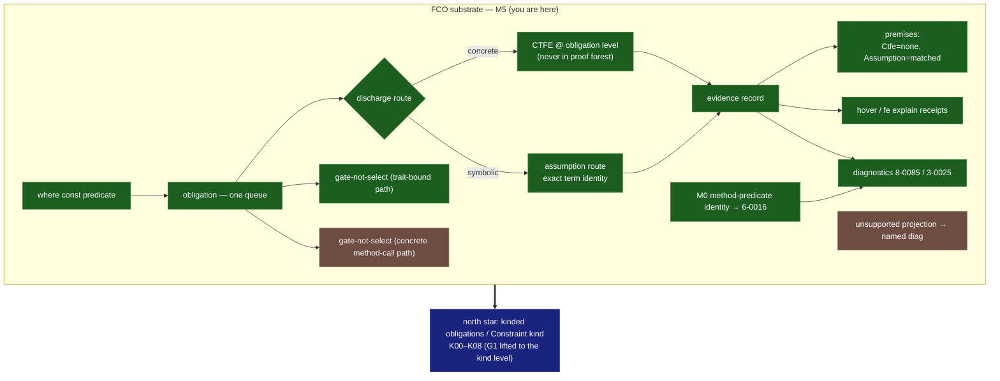

# FCO status snapshot

**Snapshot as of commit `f3c63e1f4` (2026-06-14). The repo is authoritative;
the full DAG is `fco_dependency_graph_v0.json`. Update this after each gate
commit.**

| Item | Status | Anchor |
|---|---|---|
| Obligation pipeline · CTFE + assumption routes | **COMPLETE_AND_TESTED** | gates 1/3/4–7 |
| Evidence + premises (Ctfe none / Assumption matched) | **COMPLETE_AND_TESTED** | A3 `abf8a6247` |
| Hover / receipts | **COMPLETE_AND_TESTED** | gate 10 |
| Gate-not-select — trait-bound path | **COMPLETE_AND_TESTED** | gate 2 |
| M0 method const-predicate conformance (`6-0016`) | **COMPLETE_AND_TESTED** | `468bb69b7` |
| Gate-not-select — **concrete `w.big()` path** | **PARTIAL** | Gate-2 tail — quarantined |
| Expressibility-limit diagnostic (dedicated `8-0086`) | **PARTIAL** | named-not-ICE holds (`2-0002`) |
| WF-position evidence recording | **BLOCKED_BY_DESIGN** | — |
| **Kinded obligations / `Constraint` kind (north star)** | **NOT_EXPRESSIBLE_YET (tracked)** | K00–K08; track-now-implement-later |

**Lint:** branch passes `cargo fmt --all --check` + `clippy -D clippy::all` for
tracked code (`6207a808d`, `ed9754748`). The untracked
`crates/contract-harness/tests/foundry_gas.rs` is parallel-session WIP, broken,
and absent on a clean checkout.

**Next:** Gate-2 tail (unify the concrete method-call path through the same
selected-impl obligation emitter as the trait-bound path) → then `8-0086`
expressibility polish. K01 (named diagnostics for planned kind forms) is the
sanctioned early pull on the north-star spine.
