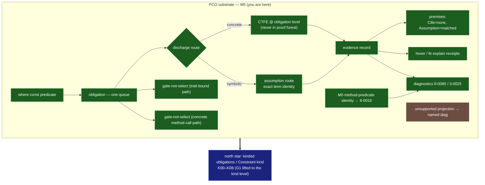

# FCO status snapshot

> **⚠️ ARCHIVAL SNAPSHOT as of commit `f3c63e1f4` (2026-06-14).** This mermaid view
> is no longer maintained per-commit. For current status use the live sources:
> **`fco_dependency_graph_v0.json`** (the DAG, kept current) and
> **`FCO_ABSTRACT_HEAD_RESEARCH_DOSSIER.md`** (the abstract-head decision). The repo
> is authoritative over any doc.
>
> **Landed since this snapshot (2026-06-15):**
> - **W-B (K03-concrete):** `where Eq<T>` → `TraitInstId`, enforced like `where T: Eq`,
>   end-to-end against real `core::ops::Eq` (no new `TyData`, no `ConstraintTerm`).
> - **D7 wizard verdict:** ship the projection; `ConstraintTerm` off the critical path.
> - **Abstract head (`P : * -> Constraint` solving):** SHELVED-WITH-RUNWAY (two gates —
>   feasibility open + demand empty); named `6-0008` rejection shipped; coherent
>   use-driven design (solve-line + Tier A/B/C) recorded in the dossier.
> - **Tier A constraint aliases:** identified as the next shippable, low-risk win
>   (transparent-expand over K02a + W-B + `PredicateListId`; NOT the abstract head).
> - **G1:** provider `require` diagnostics now name the trait + the fix.
> - **K04a:** capability recognition is by resolved identity (string-key = fixture
>   compat shim, removal target).
>
> The mermaid below reflects the M5 substrate as of the snapshot and is still
> broadly accurate for that layer.

| Item | Status | Anchor |
|---|---|---|
| Obligation pipeline · CTFE + assumption routes | **COMPLETE_AND_TESTED** | gates 1/3/4–7 |
| Evidence + premises (Ctfe none / Assumption matched) | **COMPLETE_AND_TESTED** | A3 `abf8a6247` |
| Hover / receipts | **COMPLETE_AND_TESTED** | gate 10 |
| Gate-not-select — trait-bound path | **COMPLETE_AND_TESTED** | gate 2 |
| M0 method const-predicate conformance (`6-0016`) | **COMPLETE_AND_TESTED** | `468bb69b7` |
| Gate-not-select — concrete `w.big()` path | **COMPLETE_AND_TESTED** | Gate-2 tail `0ebd3be8a` (shared adapter) |
| Expressibility-limit diagnostic (dedicated `8-0086`) | **PARTIAL** | named-not-ICE holds (`2-0002`) |
| WF-position evidence recording | **BLOCKED_BY_DESIGN** | — |
| **Kinded obligations / `Constraint` kind (north star)** | **NOT_EXPRESSIBLE_YET (tracked)** | K00–K08; track-now-implement-later |

**Lint:** branch passes `cargo fmt --all --check` + `clippy -D clippy::all` for
tracked code (`6207a808d`, `ed9754748`). The untracked
`crates/contract-harness/tests/foundry_gas.rs` is parallel-session WIP, broken,
and absent on a clean checkout.

**Next:** `8-0086` expressibility-limit polish (dedicated diagnostic over the
current `2-0002`) closes the M5 diagnostic tail. K01 (named diagnostics for
planned kind forms — `A<B> -> *`, `* -> A<B>`, `* -> Constraint`) is the
sanctioned early pull on the north-star spine.
